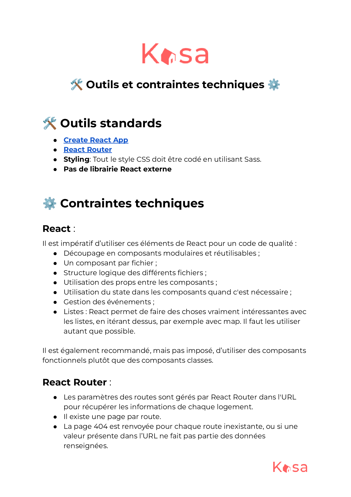
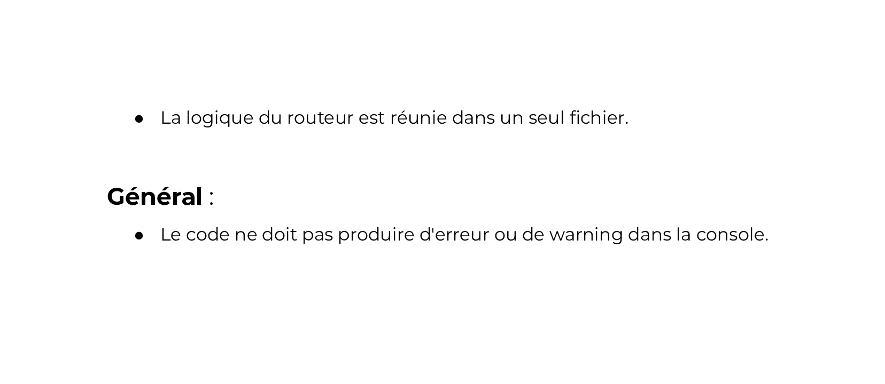

# Projet OpenClassrooms - Creez-une-application-web-de-location-immobiliere-avec-React - Kasa 

## Contexte

Vous êtes développeur front-end en freelance pour Kasa, une entreprise de location d’appartements entre particuliers.

Avec plus de 500 annonces postées chaque jour, Kasa fait partie des leaders de la location d’appartements entre particuliers en France.

L'occasion parfaite pour vous d'ajouter une belle référence à votre portfolio de freelance !

Le site de Kasa a été codé il y a maintenant plus de 10 ans en ASP.NET avec un code legacy important. Laura, la CTO, a donc lancé une refonte totale pour passer à une stack complète en JavaScript avec NodeJS côté back-end, et React côté front-end.

## Contraintes fonctionnelles

Quelques précisions sur les fonctionnalités du site :

Pour le défilement des photos dans la galerie (composant Gallery) :
Si l'utilisateur se trouve à la première image et qu'il clique sur "Image précédente", la galerie affiche la dernière image. 
Inversement, quand l'image affichée est la dernière de la galerie, si l'utilisateur clique sur "Image suivante", la galerie affiche la première image. 
S'il n'y a qu'une seule image, les boutons "Suivant" et "Précédent" ainsi que la numérotation n'apparaissent pas.
La galerie doit toujours rester de la même hauteur, celle indiquée sur la maquette Figma. Les images seront donc coupées et centrées dans le cadre de l’image.
Collapse : Par défaut, les Collapses sont fermés à l'initialisation de la page. 
Si le Collapse est ouvert, le clic de l'utilisateur permet de le fermer.
Inversement, si le Collapse est fermé, un clic permet de l'ouvrir.

# Coding guidelines




## Description
Le code est développé en HTML, CSS (avec le SCSS) et en React (framework JavaScript).
La base de données est dans le dossier, dans src puis datas, dans des fichiers en format JSON.

## Structure du Dossier
- `public/`: Contient les fichiers statiques et le fichier `index.html`.
- `src/`: Contient les fichiers sources de l'application.
- `components/`: Contient les composants réutilisables, avec leurs feuilles de styles.
- `pages`: Contient les quatre pages du site sous forme de composants React, ainsi que leur fichiers de style 
- `assets/`: Contient les images
- `datas`: Contient les données sur les logements, et les collapse à propos de la page à propos
- `router`: Contient le router qui gère les routes de l'application
- `test`: Contient un test (ou plusieurs à l'avenir). Dossier qui n'était pas demandé pour la validation du projet. Il est présent juste par curiosité personnelle de commencer à m'intéresser aux test et d'essayer d'en rédiger.

## Prérequis
- npm ou yarn

## Installation
Pour installer les dépendances nécessaires, exécutez la commande suivante à la racine du dossier :
```bash
#pour installer les dépendances du fichier package.json
npm install
# puis pour lancer l'application
npm start
